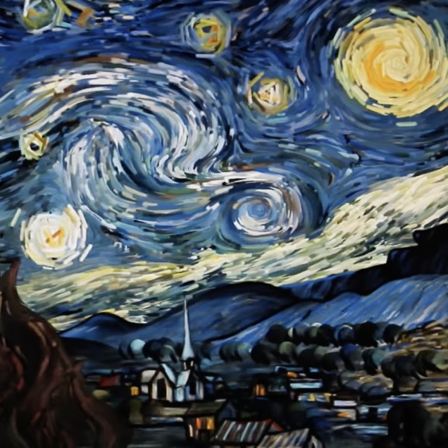
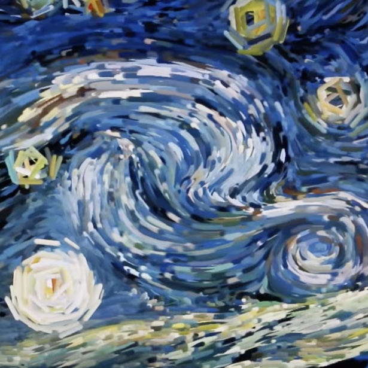
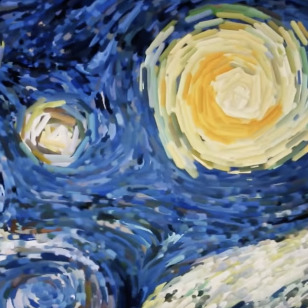
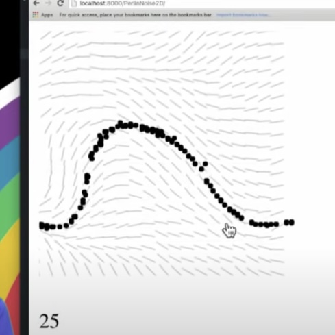
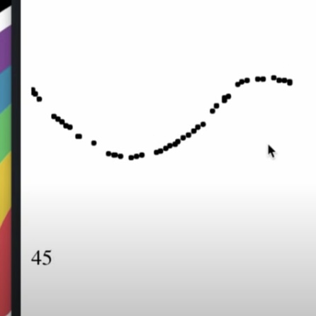
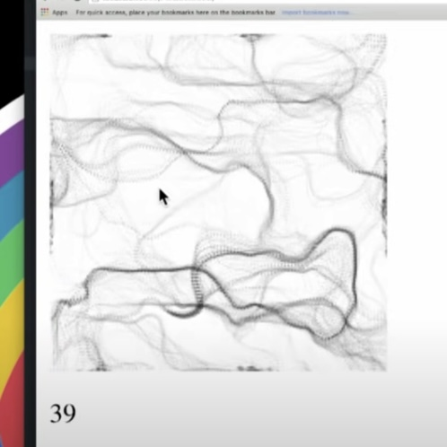

# stan0928_9103_tut2

### Part 1: Imaging Technique Inspiration

In the **Starry Night** example, **the flowing lines** are not just a visual effect, they seem to breathe life into the scene, making it vibrant and dynamic. I wish to incorporate this effect into my project because it can simulate natural phenomena found in the real world, such as wind, water currents, or flames, offering users a genuine and immersive experience. This also aligns with the animated effects demonstrated by the **"Random Seed"** requirement in the assignment.

**Screenshots of Flowing Lines in Starry Night**

### Part 2: Coding Technique Exploration

The coding technique I discovered integrates a **particle system** with **Perlin noise**. This approach harnesses a particle system in tandem with Perlin noise to craft motion patterns that echo natural phenomena. By tapping into the `noise()` function, the code spawns a non-repetitive, continuous flow field, guiding particles in a manner akin to fluid dynamics. This method mirrors the lively and spirited movement evident in the "Starry Night" example. As particles trace their trajectories, they weave intricate patterns, infusing life into the canvas.

**Screenshots of Coding Technique**

[Example Code Link](https://github.com/CodingTrain/website-archive/tree/main/CodingChallenges/CC_024_PerlinNoiseFlowField/P5)

[Example Video Link](https://www.youtube.com/watch?v=sor1nwNIP9A)
